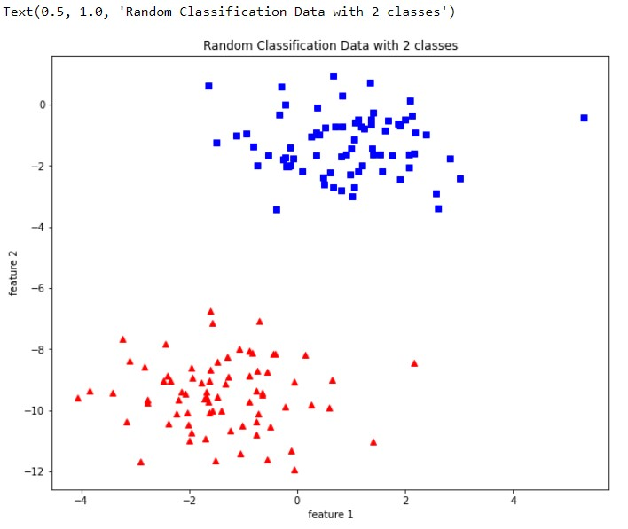

## EX:NO: 01
## DATE:

# <p align="center">RANDOM CLASSIFICATION</p>
## AIM:
To write a python program to perform random classification.

## Equipments Required:
1. Hardware – PCs
2. Anaconda – Python 3.7 Installation / Google Colab /Jupiter Notebook

## Related Theoritical Concept:
```
1.matplotlib.pyplot as plt-used to represent the given data set in a 
graphical manner. 
2.sklearn-used for statistical modelling and build machine learning models. 
3.datasets-used to introduce many small datasets and fetch large data sets. 
4.make_blobs-used to generate blobs of points with a gaussian distribution.
```
## Algorithm
## Step 1: 
Import necessary libraries from packages. 
## Step 2: 
Assign x,y values from the given dataset by sklearn. 
## Step 3: 
Plot the x and y values in the chart using mathplotlib.pyplot 
## Step 4: 
Label the values of x and y axis. 
## Step 5: 
Add title to the graph . 
## Step 6: 
Save the file and execute the program.

## Program:
```

Program to implement random classification.
Developed by   : R.SOMEASVAR
RegisterNumber : 212221230103  
```
```
import matplotlib.pyplot as plt
from sklearn import datasets
X, y = datasets.make_blobs(n_samples=150,n_features=2, centers=2,cluster_std=1.05, random_state=2)               
fig = plt.figure(figsize=(10,8))
plt.plot(X[:, 0][y == 0], X[:, 1][y == 0],'r^')
plt.plot(X[:, 0][y == 1], X[:, 1][y == 1],'bs')
plt.xlabel("feature 1")
plt.ylabel("feature 2")
plt.title('Random Classification Data with 2 classes')
```

## Output:



## Result:
Thus the random classifier was successfully implemented using python programming.
